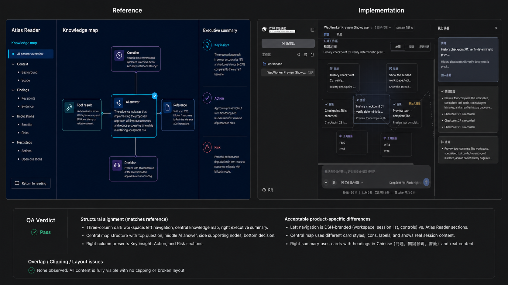

# Knowledge Workspace design QA

## Result

Passed on 2026-09-05 in the Codex in-app browser at a 1487 × 1058 viewport.

Reference: `/Users/ieongkuoksan/.codex/generated_images/01a06d3f-596c-77a2-bf17-9609b2db950d/exec-5d922107-77de-4874-99e1-7da2c9307a16.png`

Preview: `http://127.0.0.1:3099/preview.html?preview-fixture=vfs-example`

The comparison board places the selected reference and the final implementation in the same visual input. The direct in-app browser screenshots and accessibility tree captured during this run remain the authoritative evidence; the board is a presentation artifact.

## Flow coverage

| Step | Check | Result |
| --- | --- | --- |
| 1 | Open the fixture and inspect the default map, three-column layout, node spacing, and executive summary | Pass |
| 2 | Select an answer node and confirm the focus card in the summary panel updates | Pass |
| 3 | Add the selected answer to bookmarks and confirm both the node badge and bookmark section update | Pass |
| 4 | Open Reading, inspect progress and cards, then expand a question card | Pass |
| 5 | Open Original conversation and confirm the chronological transcript and tool cards remain available | Pass |
| 6 | Use Return to knowledge map and confirm the map restores | Pass |
| 7 | Reload the page and confirm the per-session bookmark remains selected | Pass |

## Visual comparison

- Structure matches the reference intent: persistent left navigation, a map-first center workspace, and an executive-summary rail.
- The graph keeps questions above, answers and the topic near the center, and tool evidence below without card overlap at the reference viewport.
- DSH-specific navigation, real session content, composer controls, and denser summary cards are intentional product differences.
- Text, controls, and selected states remain legible in the dark theme. No clipped primary control or broken layout was observed.

## Accessibility evidence

The browser accessibility tree exposed the view switcher as tabs, knowledge nodes as buttons, bookmark controls as checkboxes with updated checked state, and the return action as a button. This run did not include a full screen-reader or automated WCAG audit.
